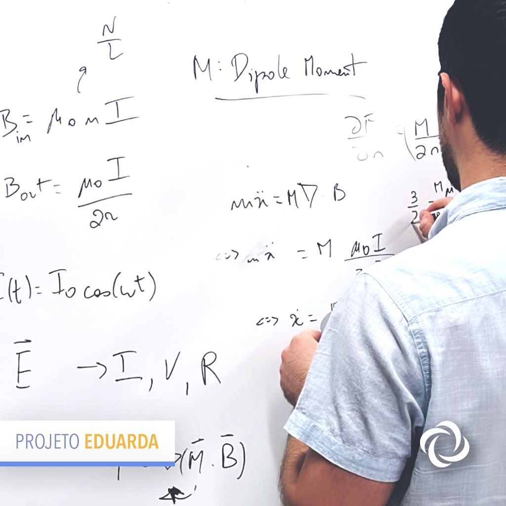
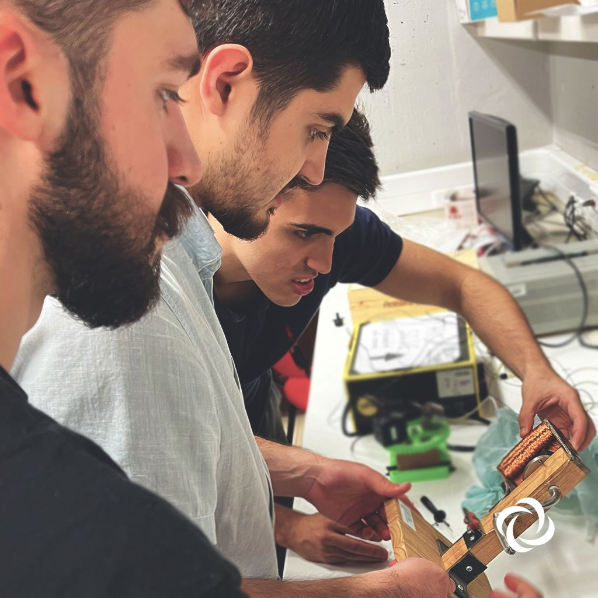
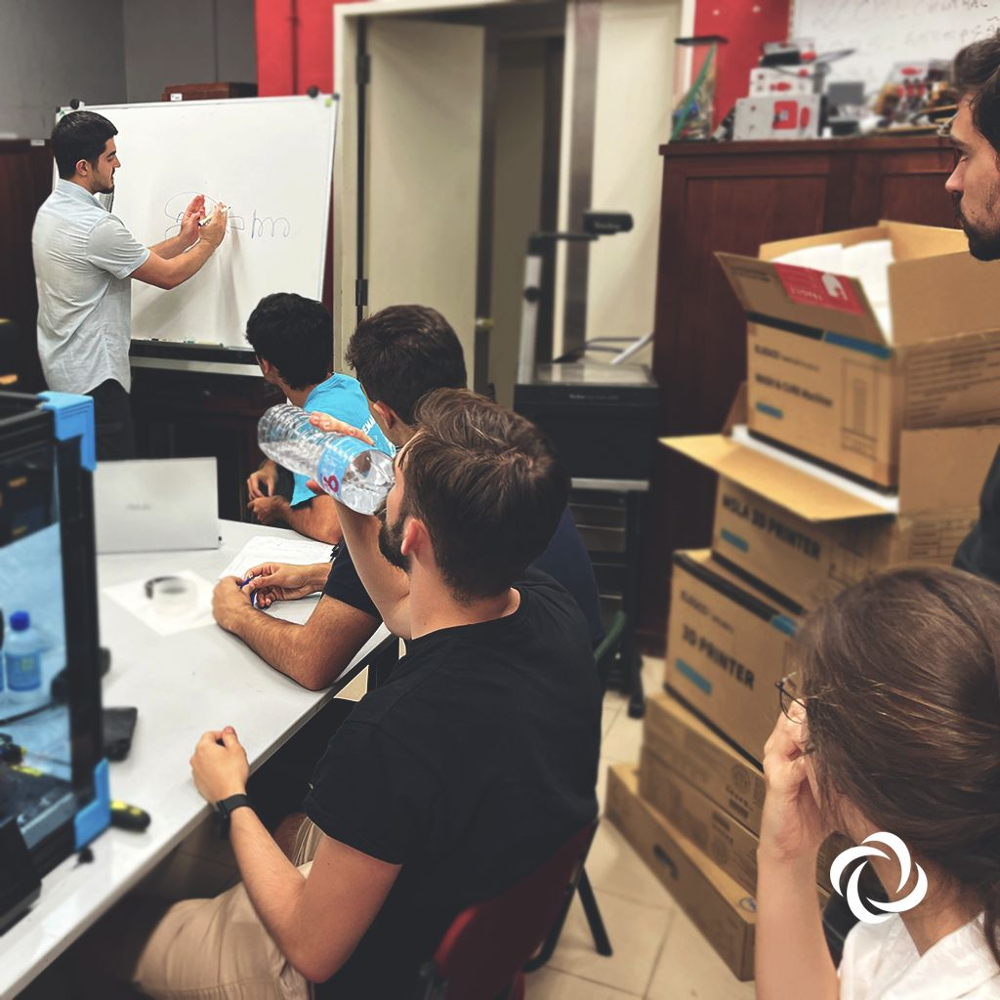
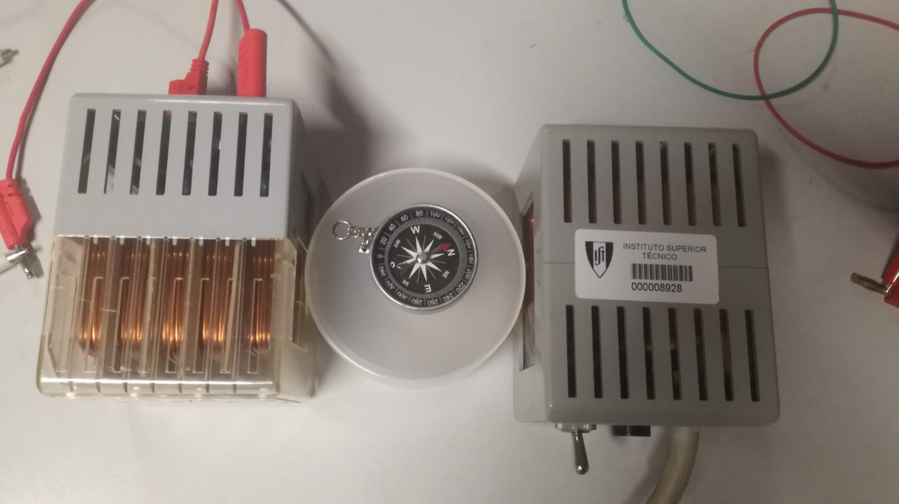

# Solenoid

O projecto trata-se de estudar a quebra de simetria de um sistema clássico, cuja aleatoriedade vem das condições iniciais, devido às ocilações de uma agulha num campo magnético. 
Coloca-se uma bússola entre dois solenóides que formam um campo magnético suficientemente intenso para destabilizar a posição central de equilíbrio da agulha. 
Estes campos têm sentidos opostos, mas intensidades semelhantes. Isto consegue-se através de um circuito em paralelo, utilizado para dividir a corrente pelos dois solenóides de forma a igualar os seus respectivos campos. Cada um introduz um torque na agulha, que irá rodar para o lado onde este é maior.  
Assim, fica definido um sistema binário, em que o lado esquerdo se caracteriza por um bit (0) e o lado direito por outro (1). Isto permite fazer estudos de Bernoulli, dependentes da intensidade dos campos.  

Este projecto tem como objectivo explorar uma forma simples, clássica e visualmente apelativa de introduzir o conceito de números aleatórios.  

O material necessário para construir um protótipo do noisR trata-se de 2 eletroímanes e uma fonte de tensão de até 10V. Agradecemos ao prof. Figueirinhas por ter cedido o material utilizado nos testes do sistema.

  

  

  

  